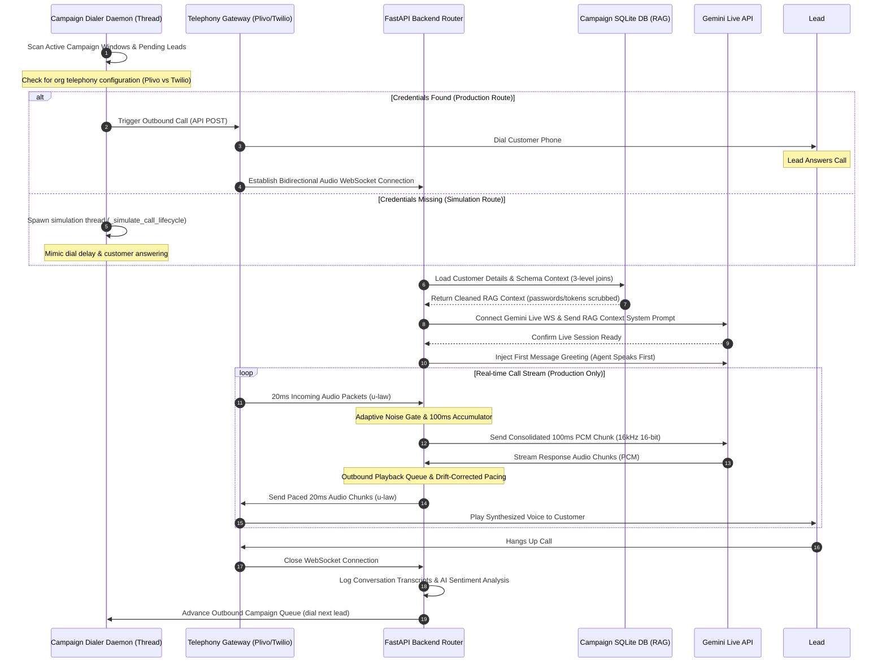

# Voqly.ai — Enterprise-Grade Conversational AI Calling Platform

Voqly.ai is a state-of-the-art, multi-tenant enterprise-grade AI conversational calling SaaS platform. It enables businesses to design, deploy, and monitor lifelike neural voice agents to handle cold calling, lead qualification, payment confirmations, and customer support. 

Powered by the **Google Gemini Multimodal Live API** and integrated with premium voice synthesis networks, Voqly.ai delivers real-time, low-latency audio-to-audio human-like conversation.

---

## 🚀 Key Features

*   **AI Agent Workspace**: Build, configure, and customize AI calling agents with specific system instructions, conversational guardrails, voices, and categories.
*   **Unified Voice Library**: A centralized voice selector featuring high-fidelity neural voices from industry-leading pipelines (ElevenLabs, Cartesia, Azure) with live text-to-speech testing.
*   **Dual-Telephony Gateway (Plivo & Twilio)**: Dynamic, org-level outbound and inbound routing support. Easily provision and assign phone numbers to agents using Plivo XML or Twilio TwiML media streams.
*   **Developer Simulation Mode**: Build, test, and verify voice agent behavior locally without configuration credentials or incurring calling costs. Calls automatically run through a simulated lifecycle with real-time logs.
*   **Dynamic Database RAG Engine**: Allows clients to upload custom database files (`.db`). The engine dynamically discovers schemas, follows relational joins (up to 3 levels), and scrubs sensitive credentials before feeding context to the AI.
*   **Jitter-Free Audio Engine**: Real-time bidirectional streaming featuring **drift-corrected outbound audio pacing**, **inbound aggregation**, and an **adaptive noise floor gate** to filter static and support smooth natural interruptions.
*   **Super Admin Command Center**: A master tenant cockpit monitoring system uptime, database response latency, MRR growth trends, infrastructure service health (SQLite, Redis, Event Bus, LLM Routers), active incidents, and AI model orchestration.
*   **Floating AI Chat Support Widget**: A premium interactive support agent built into the dashboard. Features vision analysis (Llama 3.2 Vision) for UI screenshot uploads and audio message transcriptions (Whisper via Groq).

---

## 📂 Project Structure & Layout

Voqly.ai is structured as a decoupled fullstack application with a FastAPI backend and a Next.js frontend:

```
VoqlyAI-main/
├── backend/                  # FastAPI Application Service
│   ├── main.py               # Main application entry point, DB migration & runner
│   ├── requirements.txt      # Python dependencies
│   ├── voqly_local.db        # SQLite system database (tables, campaigns, logs)
│   ├── app/
│   │   ├── controllers/      # High-level business flows & dialer logic
│   │   │   └── dialer.py     # Background dialer thread daemon & call simulator
│   │   ├── db/               # SQLAlchemy connection pool & session configuration
│   │   ├── models/           # Declarative database tables (User, Lead, Campaign, CallLog, Phone)
│   │   │   └── all_models.py # ORM Declarations (Users, Orgs, Agents, PhoneNumbers, Invoices)
│   │   ├── schemas/          # Pydantic validation schemas for API requests & responses
│   │   ├── services/         # Core utility services (knowledge base loaders, DB lookup, prompt builders)
│   │   │   ├── agent_call_context.py  # Crucial context assembler, database parser & security scrubbers
│   │   │   └── gemini_live.py         # Live WebSocket connection utilities for Gemini
│   │   ├── tasks/            # Celery asynchronous tasks for background queue simulations
│   │   │   └── celery_app.py # Celery app configuration and task runners
│   │   └── views/            # Endpoint routers & WebSocket managers
│   │       ├── api_v1.py              # Main router indexing all sub-routers
│   │       ├── calling_router.py      # Real-time Plivo/Twilio/Gemini WebSocket audio logic
│   │       ├── dashboard_router.py    # Analytics, voice library, campaigns, and leads endpoints
│   │       ├── superadmin_router.py   # Multi-tenant cockpits, incident updates, settings, AI orchestration
│   │       └── auth_router.py         # Login, registrations, and token handshakes
│   └── scripts/              # Migration, utility, and inspection scripts
│
├── frontend/                 # Next.js 15 (React 19, TypeScript) Dashboard
│   ├── package.json          # Node dependencies & running scripts
│   ├── tsconfig.json         # TypeScript configuration
│   ├── .env.local            # Frontend environment variables
│   └── src/
│       ├── app/              # App Router pages (login, dashboard, onboarding, superadmin)
│       │   └── layout.tsx    # Root layout mounting global providers & floating chat widget
│       ├── components/       # Interface modules
│       │   ├── dashboard/    # Tab modules (leads, campaigns, analytics, settings, builder)
│       │   ├── chat-support/ # Floating AI Chat Support Widget
│       │   │   └── chat-support-agent.tsx # Groq-powered Chat Support Agent (Vision + TTS Transcription)
│       │   └── ui/           # Atomized reusable UI elements (buttons, inputs, cards, tables)
│       ├── store/            # Zustand state containers (leads, agents, numbers, campaigns)
│       └── types/            # TypeScript interface structures and declarations
│
└── databses/                 # Storage for dynamically uploaded campaign SQLite databases
    └── org_{org_id}/
        └── {category}/
            └── {subcategory}/
                └── rhea_ecommerce.db  # Dynamic custom customer database
```

---

## ⚙️ System Architecture & Call Lifecycle

Voqly.ai connects multiple real-time channels asynchronously. Below is the lifecycle flow of a scheduled outbound campaign call:



---

## 📞 Advanced Audio Engine Mechanics

To support high-quality voice interactions, the backend includes customized audio handling in [calling_router.py](file:///Users/preetborad/Preet/Preet%20AI%20Porjects/VoqlyAI/VoqlyAI-main/backend/app/views/calling_router.py):

### 1. Drift-Corrected Outbound Pacing Queue
VoIP systems like Plivo expect a continuous, steady stream of audio packets. 
*   **The Problem**: Using simple loops like `asyncio.sleep(0.02)` drifts over time due to OS scheduling latency, leading to audio stuttering, robotics, or dropped connection blocks.
*   **The Solution**: Outbound voice packets are placed in an `outbound_audio_queue`. A dedicated playback task (`plivo_playback_loop` or `twilio_playback_loop` in [calling_router.py](file:///Users/preetborad/Preet/Preet%20AI%20Porjects/VoqlyAI/VoqlyAI-main/backend/app/views/calling_router.py)) splits the data into 160-byte chunks of u-law audio (representing exactly 20ms of audio at 8kHz, 8-bit mono).
*   **Timing Correction**: The loop calculates the exact expected elapsed time based on the bytes sent:
    $$\text{expected\_time} = \frac{\text{bytes\_sent}}{8000.0}$$
    It compares this with the actual wall time elapsed and sleeps only for the difference:
    ```python
    sleep_time = expected_time - elapsed_time
    if sleep_time > 0:
        await asyncio.sleep(sleep_time)
    ```
*   **Click Prevention**: If there is a silence gap (no audio received in the queue for 50ms), the player automatically pads any remaining partial audio chunk in the accumulator with u-law silence (`0xff`) and flushes it, preventing pops or clicks.

### 2. 100ms Inbound Packet Aggregation
Sending small 20ms packets over the internet to Gemini's WebSocket results in high overhead and potential socket congestion. The backend collects raw 20ms incoming blocks from Plivo, rate-converts them to 16kHz 16-bit PCM, and aggregates them into **100ms (3200-byte) consolidated chunks** before dispatching them to the Gemini Live session.

### 3. Adaptive Noise Floor Gate
Static noise gates fail when the user is in a noisy environment (like a cafe or traffic). The system utilizes an adaptive noise gate:
*   **Noise Floor Tracking**: Dynamically tracks the baseline background noise level using a moving average:
    *   *Below noise floor*: `noise_floor = noise_floor * 0.95 + rms * 0.05`
    *   *Above noise floor*: `noise_floor = noise_floor * 0.999 + rms * 0.001`
*   **Dynamic Thresholding**: Sets the opening threshold dynamically to `noise_floor + 250` (capped with a minimum of `350` RMS).
*   **Gate Hold Counter**: Keeps the gate open for `GATE_HOLD_PACKETS = 25` (500ms) after speech drops below the threshold, preventing word clipping at the end of sentences.

---

## 🗄️ RAG & Dynamic SQLite Custom Databases

When a call starts, the engine looks up client details. The system supports uploading dynamic SQLite databases (`.db` files) per campaign to handle variable workflows (see [agent_call_context.py](file:///Users/preetborad/Preet/Preet%20AI%20Porjects/VoqlyAI/VoqlyAI-main/backend/app/services/agent_call_context.py)):

### 1. Table & Column Discovery
The service searches `sqlite_master` in the uploaded `.db` file for tables. It scans column names using fuzzy matching to locate identity indicators:
*   **Phone columns**: Matches containing `phone`, `mobile`, `tel`, `contact`, or `number`.
*   **Name columns**: Matches containing `name`, `customer`, `user`, `client`, or `lead`.

### 2. Recursive Relational Joins (Up to 3 Levels)
When a lead is matched by name or phone (normalized to the last 10 digits), the database engine tracks all columns ending with `_id` (e.g. `user_id`, `order_id`, `product_id`). It recursively searches other tables for records sharing these ID values up to three relations deep, automatically gathering related tables (like shopping carts, historical order lists, shipping addresses, or items).

### 3. Context Injection & Reference Tables
For non-private tables (tables not containing emails, passwords, or telephone numbers), the engine queries up to 100 rows to use as reference. This injects product catalogs, pricing guidelines, and shipping rules directly into Gemini's system instructions.

### 4. Credential Security Filtering
To protect customer data, the system automatically sanitizes context injected into the AI's prompt. It strips columns containing:
*   `password`, `token`, `pin`, `credential`, `mfa`, `key`, `secret`, `salt`, `username`.

---

## 👑 Super Admin Command Center

The Super Admin portal routed via [superadmin_router.py](file:///Users/preetborad/Preet/Preet%20AI%20Porjects/VoqlyAI/VoqlyAI-main/backend/app/views/superadmin_router.py) gives complete SaaS control over SaaS health and tenants:

| Feature Area | Functionality | Code References |
| :--- | :--- | :--- |
| **System Uptime & Latency** | Monitors real-time SQLite database latencies, uptime percentages, and concurrent streams. | `get_admin_metrics()` in [superadmin_router.py](file:///Users/preetborad/Preet/Preet%20AI%20Porjects/VoqlyAI/VoqlyAI-main/backend/app/views/superadmin_router.py#L49-L130) |
| **Tenant Control** | View, suspend/unsuspend DID lines, adjust margins, and register new organizations. | `list_vendors()`, `suspend_vendor()`, `register_vendor()` |
| **AI Provider Routing** | Manage, enable/disable AI backends (OpenAI, Anthropic, Gemini, Llama) with smart usage-based routing rules. | `get_ai_providers()`, `update_routing_rules()` |
| **Incident Logger** | Tracks platform warnings/errors, logs operational events, and lets admins publish resolution updates. | `get_infra_health()`, `post_incident_update()`, `resolve_incident()` |

---

## 💬 Floating AI Chat Support Widget

A floating support widget is mounted inside Next.js layout ([layout.tsx](file:///Users/preetborad/Preet/Preet%20AI%20Porjects/VoqlyAI/VoqlyAI-main/frontend/src/app/layout.tsx)) to assist users with onboarding and setup:

*   **Transcription Support**: Utilizes the **Groq Whisper API** (`whisper-large-v3`) to record and transcribe audio messages in real-time, allowing users to send voice commands.
*   **Vision & Image Analysis**: Allows users to upload a screenshot of their dashboard or billing issues. The widget dispatches the image + prompt to Groq's **Llama 3.2 Vision** model (`llama-3.2-11b-vision-preview`) for visual troubleshooting.
*   **Smart Conversational Flow**: Configured with professional support guardrails using **Llama 3.3** (`llama-3.3-70b-specdec`), ensuring natural, concise, and helpful platform assistance.

---

## 🏃 Local Setup & Run Guide (Step-by-Step)

To run the full Voqly.ai ecosystem locally, you will need to open **5 separate terminal windows or tabs** to run the services concurrently. Follow this sequence:

### Terminal 1: Start Redis (Task Queue Broker)
Redis serves as the task broker enabling the background dialers and Celery workers to coordinate.
```bash
# On macOS, start Redis as a background service:
brew services start redis

# Or run Redis directly in the foreground:
redis-server
```

---

### Terminal 2: Expose Local Port with ngrok (VoIP Tunnel)
Plivo and Twilio require a public HTTPS URL to deliver webhook triggers (call answer and status events) back to your local server.
1. Run ngrok to tunnel port `5011`:
   ```bash
   ngrok http 5011
   ```
2. Copy the forwarding URL generated by ngrok (e.g., `https://xxxx.ngrok-free.dev`).
3. Set this URL as the value of `BASE_URL` in your backend `.env` file:
   ```env
   BASE_URL=https://xxxx.ngrok-free.dev
   ```
   *(Note: Whenever you restart ngrok and get a new URL, you must update the `BASE_URL` in backend `.env` and restart the Uvicorn backend server).*

---

### Terminal 3: Start the FastAPI Backend API
1. Navigate to the backend directory:
   ```bash
   cd backend
   ```
2. Create your virtual environment (first time setup):
   ```bash
   python -m venv Demo
   ```
3. Activate the virtual environment:
   ```bash
   # On macOS/Linux:
   source Demo/bin/activate
   # On Windows:
   .\Demo\Scripts\activate
   ```
4. Install all Python dependency packages:
   ```bash
   pip install -r requirements.txt
   ```
5. Ensure your backend environment config (`backend/.env`) is correctly set up.
6. Launch the FastAPI server:
   ```bash
   uvicorn main:app --host 0.0.0.0 --port 5011 --reload
   ```
   *The local API will run at `http://localhost:5011` and auto-generated OpenAPI docs will be at `http://localhost:5011/docs`.*

---

### Terminal 4: Start the Celery Worker Daemon (Optional)
The Celery worker is configured to poll campaign dial windows, schedule outbound campaigns, and dial leads sequentially.
1. Navigate to the backend directory:
   ```bash
   cd backend
   ```
2. Activate your virtual environment:
   ```bash
   source Demo/bin/activate
   ```
3. Start the worker process:
   ```bash
   celery -A app.tasks.celery_app worker --loglevel=info
   ```

> [!NOTE]
> If Celery/Redis are not running, the platform's internal `CampaignDialerThread` (background thread started at app boot in [main.py](file:///Users/preetborad/Preet/Preet%20AI%20Porjects/VoqlyAI/VoqlyAI-main/backend/main.py)) automatically handles sequential dialing and call simulation locally.

---

### Terminal 5: Start the Next.js Frontend Client
1. Navigate to the frontend directory:
   ```bash
   cd frontend
   ```
2. Install npm dependency modules:
   ```bash
   npm install
   ```
3. Ensure your local environment variables (`frontend/.env.local`) are set up.
4. Launch the Next.js development server:
   ```bash
   npm run dev
   ```
   *The frontend React portal will be live at `http://localhost:5012`.*

---

## ⚙️ Environment Configurations

### Backend Environment Variables (`backend/.env`)
Create a `.env` file inside the `backend` folder:
```env
# Server URL settings
BASE_URL=https://xxxx.ngrok-free.dev            # Your public ngrok tunnel URL

# Plivo Integration Credentials
PLIVO_AUTH_ID=your_plivo_auth_id
PLIVO_AUTH_TOKEN=your_plivo_auth_token
PLIVO_FROM_NUMBER=your_plivo_rented_phone_number # Format: +1234567890

# Twilio Integration Credentials
TWILIO_ACCOUNT_SID=your_twilio_account_sid
TWILIO_AUTH_TOKEN=your_twilio_auth_token
TWILIO_FROM_NUMBER=your_twilio_rented_phone_number # Format: +1234567890

# AI Models (Gemini Live API)
GEMINI_API_KEY=your_gemini_api_key
GEMINI_MODEL=gemini-2.0-flash-exp               # Multimodal Live API model

# (Optional) WebRTC / LiveKit Settings
LIVEKIT_URL=wss://your-project.livekit.cloud
LIVEKIT_API_KEY=your_livekit_key
LIVEKIT_API_SECRET=your_livekit_secret

# (Optional) Payments
STRIPE_SECRET_KEY=sk_test_...
```

### Frontend Environment Variables (`frontend/.env.local`)
Create a `.env.local` file inside the `frontend` folder:
```env
# Firebase Authentication Keys
NEXT_PUBLIC_FIREBASE_API_KEY=AIzaSy...
NEXT_PUBLIC_FIREBASE_AUTH_DOMAIN=vooqlyai.firebaseapp.com
NEXT_PUBLIC_FIREBASE_PROJECT_ID=vooqlyai
NEXT_PUBLIC_FIREBASE_STORAGE_BUCKET=vooqlyai.firebasestorage.app
NEXT_PUBLIC_FIREBASE_MESSAGING_SENDER_ID=xxxx
NEXT_PUBLIC_FIREBASE_APP_ID=1:xxxx:web:xxxx
NEXT_PUBLIC_FIREBASE_MEASUREMENT_ID=G-xxxx

# Backend API Endpoint
NEXT_PUBLIC_API_URL=http://localhost:5011/api/v1

# Groq API Key (for the Floating AI Chat Support Widget)
NEXT_PUBLIC_GROQ_API_KEY=gsk_your_groq_api_key
```

---

## 📋 CSV Upload Template Guidelines
When importing new leads into the campaigns dashboard, Excel or CSV files **must** include the following headers (case and space tolerant):
1.  `Customer Name` — The full name of the target lead.
2.  `Phone Number` — The lead's phone number in E.164 format (e.g. `+15551234567`).

*Note: If these headers are missing, the dashboard will reject the import to ensure calling agents have correct customer details during operations.*

---

## 🛡️ License & Disclaimers
This project is proprietary and confidential. Unauthorized copying, distribution, or execution of these services is strictly prohibited. For questions or internal support, contact the system administrator.
